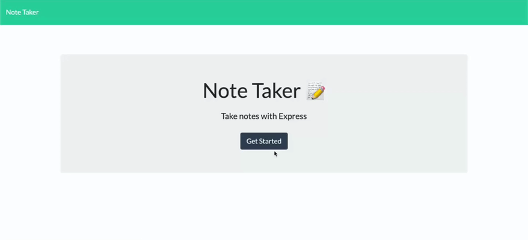

# Note Taker 

## Description 
This application is used to write and save notes. It uses an Express.js backend and will save and retrieve notes' data from a JSON file.

## Mock Up 
The following animated photo shows the web application's appearance and functionality:

### Heroku Deployed Link: https://zay-note-taker.herokuapp.com/
